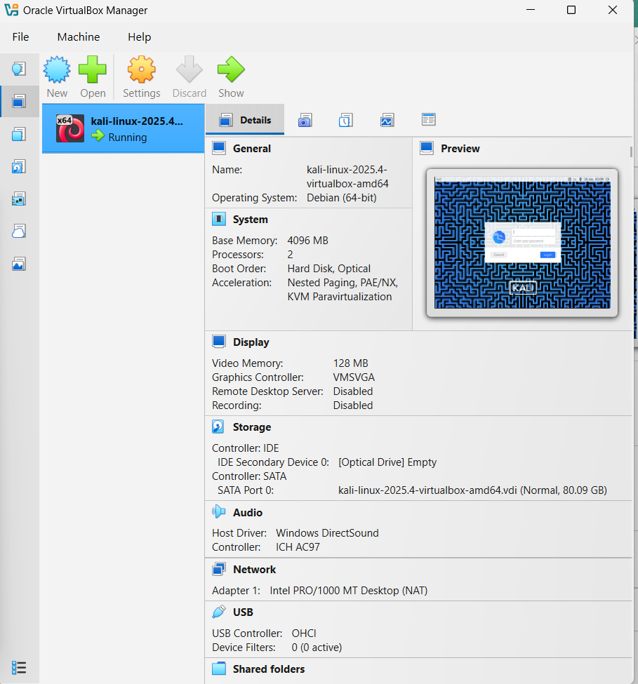
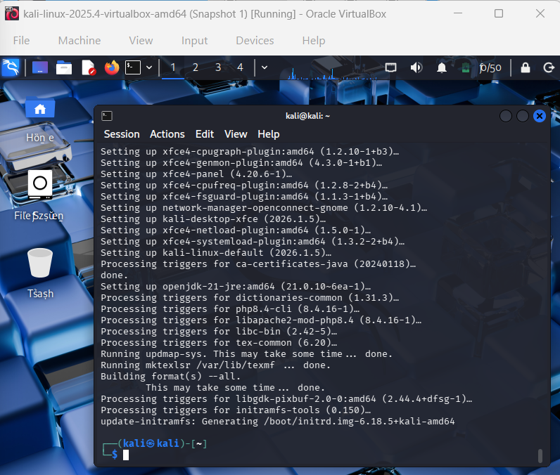

# Cybersecurity-Home-Lab
This repository contains my personal home lab setup using Kali Linux in VirtualBox.  It includes screenshots of VM configuration, OS updates, and working security tools like Nmap, Wireshark, and Metasploit. The lab was built for practicing Linux commands, network scanning, and basic cybersecurity tasks.
## Lab Setup
- Host OS: Windows
- Virtualization: Oracle VirtualBox
- Guest OS: Kali Linux
- Networking: NAT + Host-Only Adapter
## Tools Used
- Nmap
- Wireshark
- Metasploit
## Key Activities
- Network scanning and service enumeration
- Packet capture & analysis
- Linux navigation and log review
## Screenshots
### VM Configuration
  
  
  

### System Updates
  
  

### Tool Versions
  
  
  

### Internet Test / Final Verification

## Skills Gained
- Virtualization & VM configuration
- Networking fundamentals
- Traffic analysis basics
- Cybersecurity documentation

## Disclaimer
All testing was done in controlled, isolated VMs.

